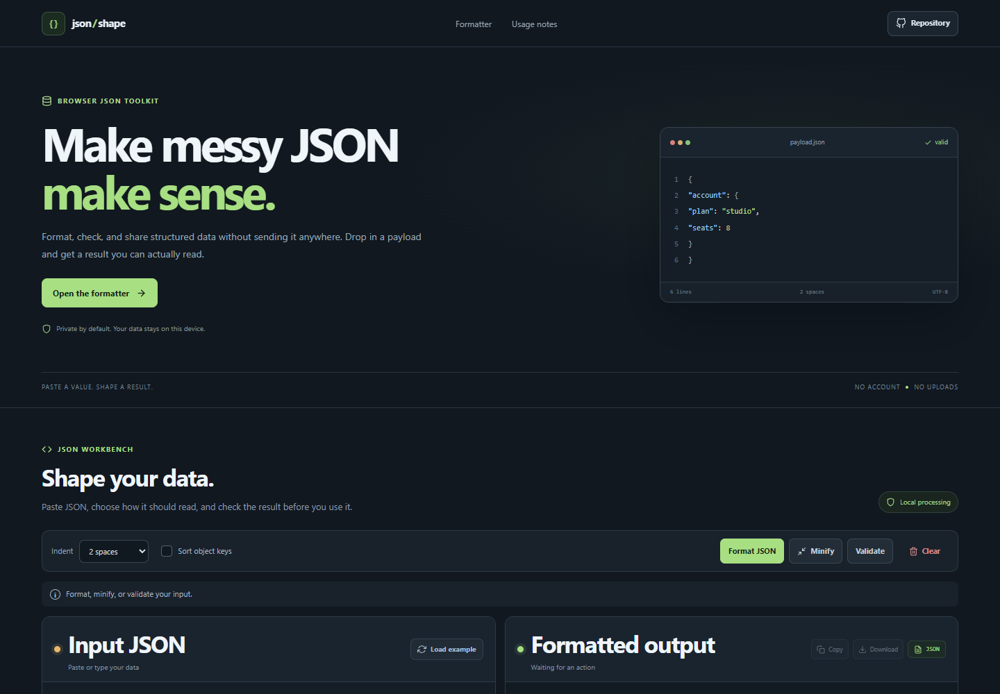



# JSON Formatter

Format, minify, validate, and inspect JSON in a private browser-only workbench. The tool gives invalid syntax a useful location, applies optional object-key sorting, and lets you copy or download a result.

**Live app:** [https://a2rp.github.io/json-formatter/](https://a2rp.github.io/json-formatter/)

## How to use it

Paste or type JSON in the input panel, or select **Load example** to restore the sample. Choose two or four spaces for indentation. Turn on **Sort object keys** if you want keys ordered alphabetically at every object level. Then choose **Format JSON**, **Minify**, or **Validate**.

Formatting creates readable output in the right panel. Minify removes unnecessary whitespace. Validate checks syntax without creating output. Invalid input displays the parser message and, when the browser provides a position, its line and column. Use **Copy** to copy the current output, or **Download** to save it as formatted.json.

Choose **Clear** to open a confirmation dialog before removing the input and result. **Keep my JSON**, the close button, clicking outside the dialog, or pressing Escape cancels without changing the editor. **Load example** replaces the input with the sample immediately.

## What is included

- A two-panel editor for source JSON and formatted output.
- Format with two-space or four-space indentation.
- Minify and validate actions with clear success and error states.
- Optional recursive alphabetical sorting of object keys.
- Syntax-colored output with line numbers.
- Error locations with line and column when available from the browser's JSON parser.
- Copy and download actions for the output.
- A sample payload, live line count, and a confirmation dialog for clearing content.
- Responsive layout, keyboard focus indicators, fixed navigation, and a back-to-top button after scrolling 50 pixels.

## Data and limits

All parsing and formatting run in the current browser page. Input is not uploaded, written to local storage, or retained after a refresh or when the page is closed. Copying uses the browser clipboard API and may require a secure page context. Downloads are created locally as formatted.json.

The tool validates JSON syntax only. It does not validate an API schema or business rules. Standard JSON does not allow comments, trailing commas, single-quoted strings, or undefined values. Very large documents may be limited by the available memory and performance of the browser.

## Run locally

~~~sh
npm install
npm run dev
~~~

## Check and deploy

~~~sh
npm run lint
npm test
npm run build
npm run deploy
~~~

The deploy command builds the app and publishes dist to the gh-pages branch. The live site is [https://a2rp.github.io/json-formatter/](https://a2rp.github.io/json-formatter/).

## Future improvements

These are ideas that are not implemented yet:

- Add drag-and-drop file import and file-size feedback.
- Add JSON Pointer navigation for large documents.
- Add a schema validation mode with user-provided schemas.
- Add optional local storage that users can enable explicitly.

## Links

- Portfolio: [https://www.ashishranjan.net](https://www.ashishranjan.net)
- GitHub: [https://github.com/a2rp](https://github.com/a2rp)
- CodePen: [https://codepen.io/ash1198](https://codepen.io/ash1198)
- LinkedIn: [https://www.linkedin.com/in/aashishranjan](https://www.linkedin.com/in/aashishranjan)
- Facebook: [https://www.facebook.com/theash.ashish/](https://www.facebook.com/theash.ashish/)
- YouTube: [https://www.youtube.com/@ashishranjan-ashz?sub_confirmation=1](https://www.youtube.com/@ashishranjan-ashz?sub_confirmation=1)
- Email: [mailto:ash.ranjan09@gmail.com](mailto:ash.ranjan09@gmail.com)

## Support

- Support: [https://a2rp-donation-page.netlify.app/](https://a2rp-donation-page.netlify.app/)
- Buy Me a Coffee: [https://buymeacoffee.com/ashishranjan](https://buymeacoffee.com/ashishranjan)
- Patreon: [https://www.patreon.com/ashishranjan](https://www.patreon.com/ashishranjan)
